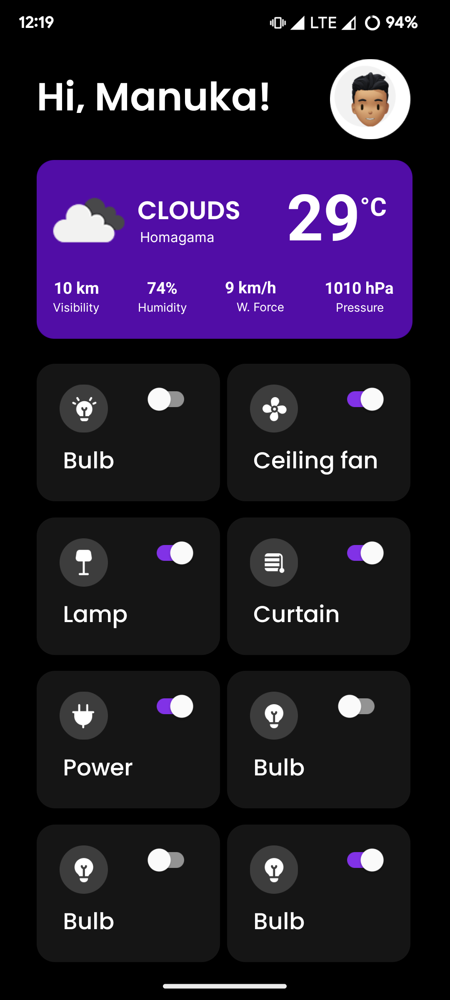

# Smart Home Dashboard with Real-time Weather

This repository hosts a Smart Home Dashboard application built using React Native and Firebase. It provides users with the ability to manage their smart home devices along with real-time weather information.

## Features

- **Firebase Integration:** Utilizes Firebase for websockets and data storage, enabling real-time updates for smart home devices.
- **Weather Component:** Integrates with a weather API to display real-time weather information.
- **Responsive Design:** Built with React Native, ensuring a responsive layout across devices.

